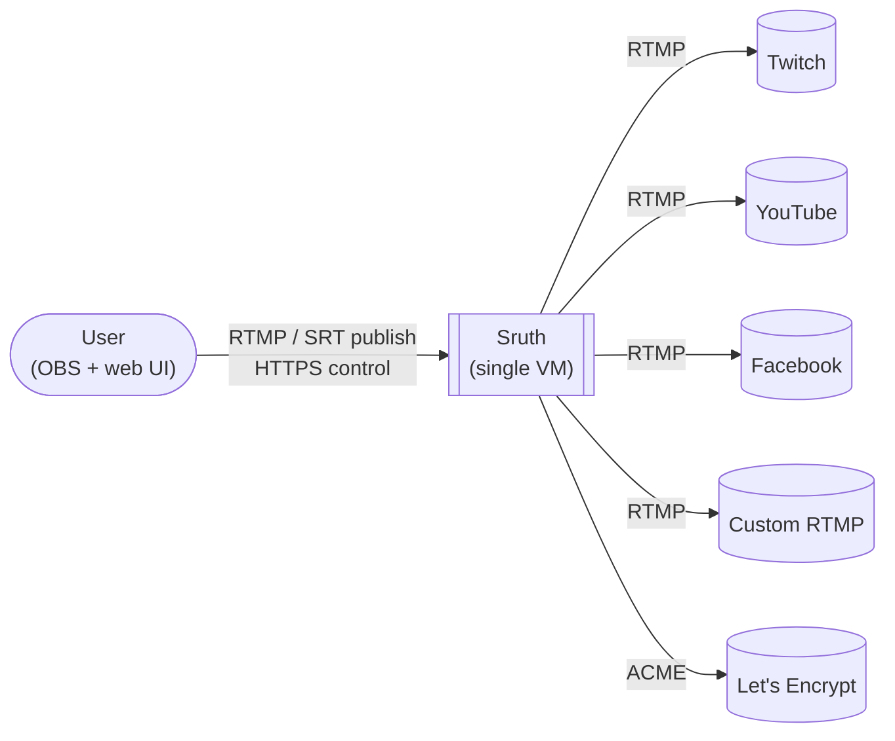
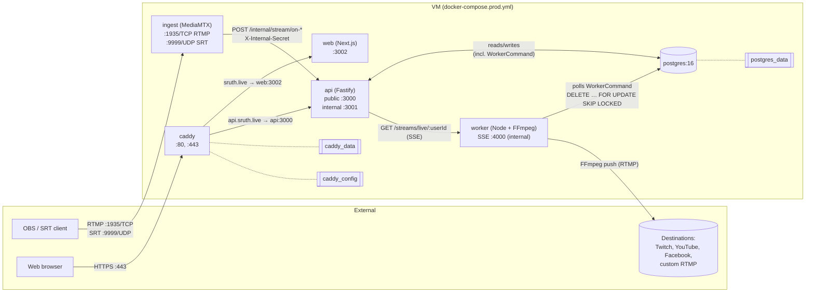
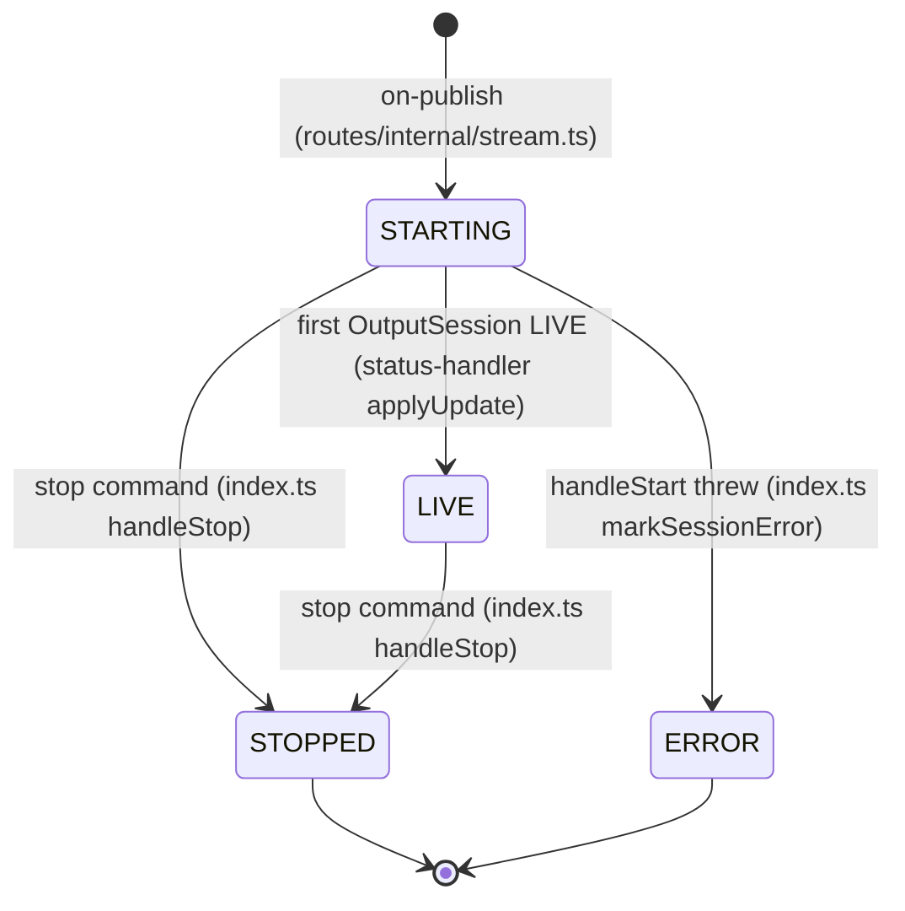
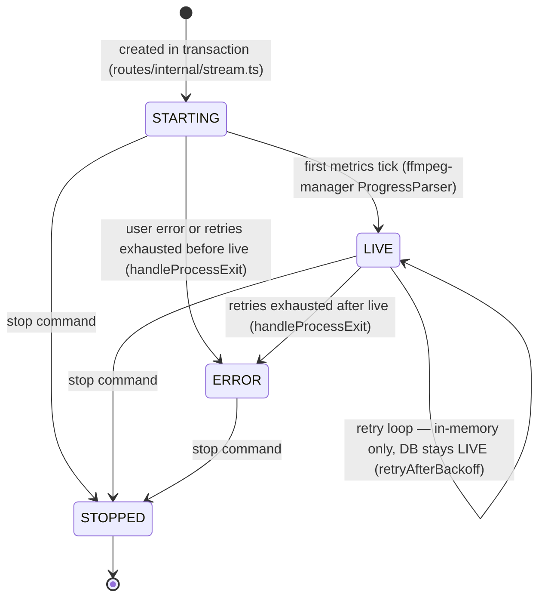
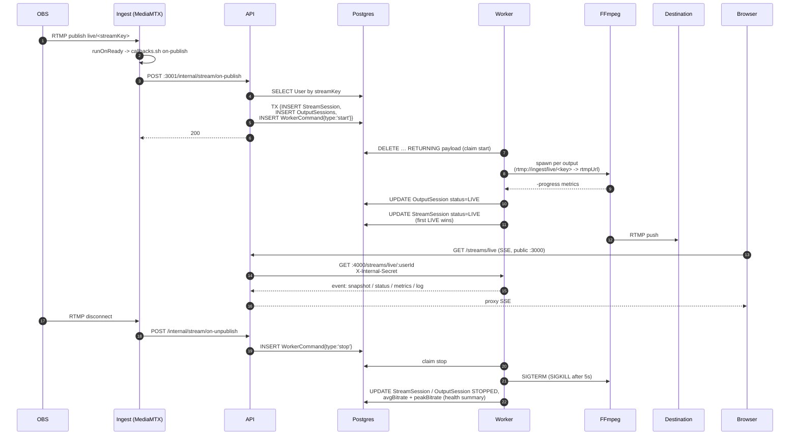
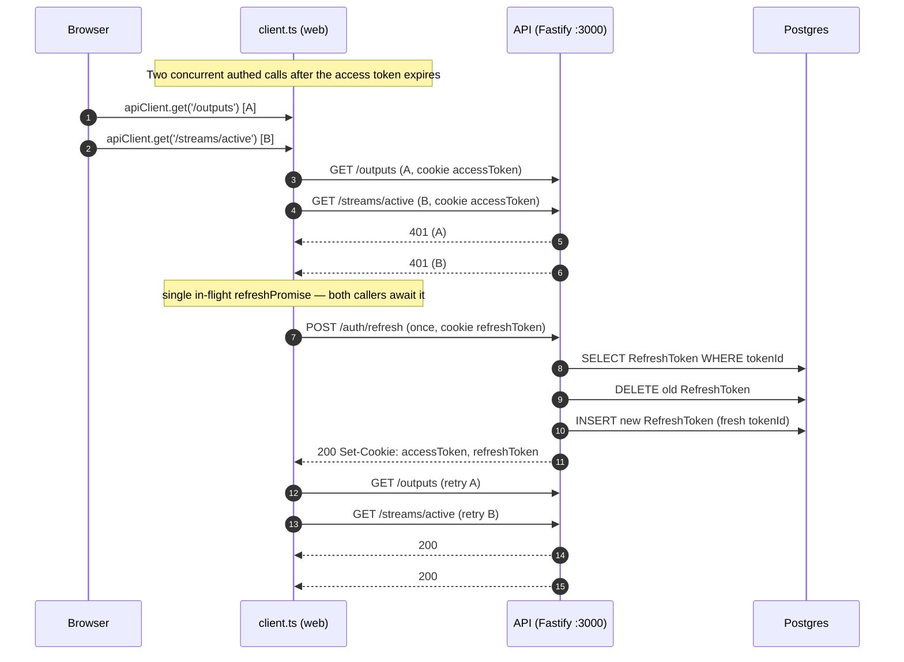
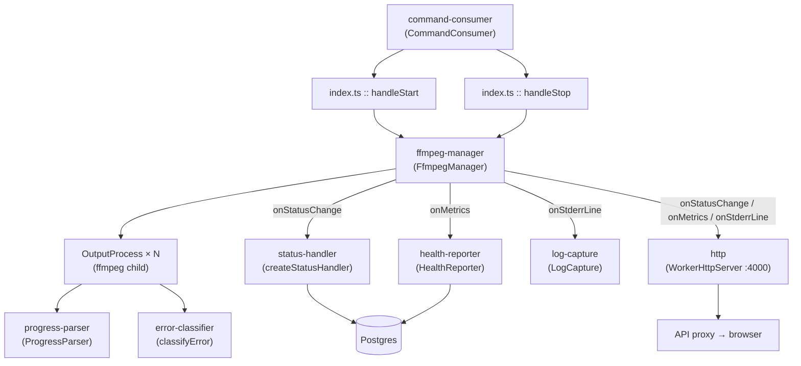

# Sruth architecture

last reviewed: 2026-04-19

## Diagrams

| Diagram | Use when… |
|---|---|
| [System context](#system-context) | Orienting a new reader — what Sruth is, who uses it, what it talks to. |
| [Runtime topology](#runtime-topology) | Debugging a port, container, or volume problem; reasoning about deploy topology. |
| [Data model](#data-model) | Planning a schema change or understanding the domain model. |
| [Session states](#session-states) | Interpreting a stuck status in the UI or logs. |
| [Stream lifecycle](#stream-lifecycle) | Tracing an end-to-end "why didn't my stream start" bug. |
| [Auth flow](#auth-flow) | Debugging 401 / 403 behavior in the browser, or touching the refresh path. |
| [Worker internals](#worker-internals) | Adding a new status/metrics callback or a new command handler inside the worker. |

---

## System context



Sources: `README.md`, `Caddyfile`, `packages/shared/prisma/schema.prisma :: enum Platform`.

The `User` role is singular today — the person publishing from OBS is the same person operating the web UI. Split into separate actors if team features land. End viewers aren't on the diagram: they watch on the destination platform, outside Sruth's boundary. `CUSTOM` is the catch-all for any user-supplied RTMP URL (self-hosted PeerTube, Restream, etc.).

---

## Runtime topology



**UFW ingress** (from `deploy/provision.sh`):

- `22/tcp` — SSH
- `80/tcp` — Caddy (ACME challenge + HTTP→HTTPS redirect)
- `443/tcp` — Caddy (HTTPS)
- `1935/tcp` — MediaMTX RTMP
- `9999/udp` — MediaMTX SRT

Sources: `docker-compose.prod.yml`, `Caddyfile`, `deploy/provision.sh`, `services/ingest/{mediamtx.yml,callbacks.sh}`, `apps/api/src/app.ts :: buildApp / buildInternalApp`, `apps/api/src/index.ts`, `apps/api/src/routes/streams.ts :: streamsRoutes`, `services/worker/src/http.ts :: WorkerHttpServer`.

The `api` container runs **two Fastify instances**: public on `:3000` (auth, outputs, streams, SSE proxy) and internal on `:3001` (ingest callbacks, gated by a shared-secret `onRequest` hook). Only `:3000` is reverse-proxied by Caddy; `:3001` is reachable only from the Docker network, so the `ingest` container can POST callbacks without that path being exposed on the public internet.

FFmpeg is a label on the `worker` node, not its own container — the worker spawns one FFmpeg process per output. Internals live in [Worker internals](#worker-internals).

---

## Data model

The ERD is auto-generated: see **[`docs/erd.md`](./erd.md)**. It's regenerated every time you run `pnpm --filter @sruth/api db:generate` via the `erd` generator block in `packages/shared/prisma/schema.prisma`. The output is committed so schema drift shows up in PR diffs.

Models (and enums) emitted: `User`, `Output`, `StreamSession`, `OutputSession`, `RefreshToken`, `WorkerCommand`, plus `Platform`, `StreamSessionStatus`, `OutputSessionStatus`.

**Not in the ERD — partial unique index on active `StreamSession`.** Prisma can't express partial indexes, so `deploy/provision.sh` applies the index as raw SQL after `prisma db push`:

```sql
CREATE UNIQUE INDEX IF NOT EXISTS "StreamSession_userId_active_key"
ON "StreamSession"("userId")
WHERE status IN ('STARTING', 'LIVE');
```

The `/internal/stream/on-publish` handler relies on this: two racing publishes with the same stream key both try to `INSERT StreamSession`, the second hits a P2002, and the handler returns 409 (`apps/api/src/routes/internal/stream.ts :: internalStreamRoutes`). Without the index, both races would create LIVE sessions for the same user.

`WorkerCommand` is the Postgres-backed queue for API → worker commands. Its schema is intentionally sparse (`id`, `payload: Json`, `createdAt`); the payload shape is typed by `packages/shared/src/commands.ts :: WorkerCommand`.

---

## Session states

Two machines, one per entity — related but not compositional.

**StreamSession:**



Today there is no `LIVE → ERROR` writer — LIVE sessions reach STOPPED either cleanly (via `handleStop`) or via `forceStopped` on a failed stop command (also landing in STOPPED, not ERROR). If we add a surface for "stream is live but broken enough we should show an error banner," it'd slot in here.

**OutputSession:**



The DB only has four states, but the worker tracks a fifth — `retrying` — in memory on `OutputProcess.status` (`ffmpeg-manager.ts :: OutputStatus`). The retry loop is up to **8 retries** with exponential backoff (`MAX_RETRIES = 8`, `BACKOFF_BASE_MS = 2000` — so 2s, 4s, 8s … ≈ 8.5 min window) in `ffmpeg-manager.ts :: retryAfterBackoff`. The sleep is cancellable via `AbortController` so a stop or shutdown aborts the pending retry immediately. Only `live` and `error` propagate to the DB (`status-handler.ts :: dbStatusFor`); `retrying` keeps the DB row on `LIVE`, and a successful reconnect writes LIVE again (incrementing `reconnectCount`). Once the worker lands the row in DB-ERROR it's terminal — there's no code path that flips ERROR back to LIVE.

**Cross-entity dependency**: when the first `OutputSession` in a session reaches LIVE, `status-handler :: applyUpdate` flips the parent `StreamSession` from STARTING to LIVE — gated by `where: { id, status: 'STARTING' }` so subsequent LIVEs are no-ops. The full orchestration lives in [Stream lifecycle](#stream-lifecycle).

Sources: `services/worker/src/{status-handler.ts :: createStatusHandler, ffmpeg-manager.ts :: FfmpegManager, index.ts :: handleStart / handleStop / markSessionError / forceStopped}`.

---

## Stream lifecycle

Happy path only — failures are in the table below.



### Failure modes

| Failure | Detecting module | State transition | User-visible? |
|---|---|---|---|
| OBS disconnects mid-stream | MediaMTX `runOnNotReady` → `services/ingest/callbacks.sh` → `apps/api/src/routes/internal/stream.ts` | API emits `WorkerCommand{type:'stop'}`; worker flips `StreamSession` + `OutputSession` to STOPPED in `index.ts :: handleStop` | Yes — live view ends; session moves out of `/streams/active`. |
| FFmpeg crashes (transient, exit ≠ 0) | `services/worker/src/ffmpeg-manager.ts :: handleProcessExit` + `error-classifier.ts :: classifyError` | `OutputProcess.status = retrying` in-memory (`retryAfterBackoff`); DB stays LIVE until retries exhaust | Yes — worker SSE pushes the `retrying` status; dashboard can show reconnect attempts. |
| Destination rejects push (bad key, auth) | `error-classifier` matches 401 / 403 / "Invalid stream key" → `user` class | `OutputSession → ERROR` with stderr tail in `lastError` | Yes — error shown per-output; no retry. |
| Output retry loop exhausts `MAX_RETRIES` (8) | `ffmpeg-manager :: handleProcessExit` after the last `retryAfterBackoff` | `OutputSession → ERROR` with trailing stderr in `lastError` | Yes — ERROR status + `lastError`. |
| Worker crashes with a live session | Next boot: `services/worker/src/index.ts :: recoverSessions` | Re-reads LIVE / STARTING sessions, respawns FFmpeg (with fresh retry counters); in-flight `WorkerCommand` rows are lost (at-most-once semantics in `command-consumer.ts`) | Eventually — there's a gap during the outage, then status snaps back via SSE. |
| API crashes between `StreamSession` insert and `WorkerCommand` insert | None needed — all three writes run in one `prisma.$transaction` in `routes/internal/stream.ts` | Atomic: either all rows exist (worker claims the command) or none do (publisher can retry after MediaMTX re-fires `on-publish`) | No — no orphan session possible. |

### Planned but not implemented

- **Logs UI subscription.** The worker→API SSE pipeline already carries `event: log` lines (`services/worker/src/http.ts :: WorkerHttpServer.pushLog`, proxied by `apps/api/src/routes/streams.ts :: streamsRoutes GET /streams/live`). The browser side (`apps/web/src/app/(app)/logs/logs-view.tsx`) hard-codes an empty `logs` array and renders the "Log streaming is not yet implemented" placeholder. Wiring `EventSource('/streams/live')` into this view is the missing step.
- **`ingest_relocated` handoff.** A stale comment in `services/worker/src/ffmpeg-manager.ts :: retryAfterBackoff` says `// Aborted (e.g. ingest_relocated or shutdown)`, but no `ingest_relocated` command type exists in `packages/shared/src/commands.ts :: WorkerCommandType` (it's `'start' | 'stop'`). The hook documents future intent for multi-node ingest where the ingest IP can change mid-stream; today there's one ingest container and the IP is overridden to the service name via `INGEST_IP_OVERRIDE`.

Sources: `services/ingest/{mediamtx.yml,callbacks.sh}`, `apps/api/src/routes/internal/stream.ts`, `apps/api/src/lib/commands.ts :: sendCommand`, `services/worker/src/{command-consumer.ts :: CommandConsumer, index.ts, ffmpeg-manager.ts, status-handler.ts, health-reporter.ts, http.ts}`, `apps/api/src/routes/streams.ts :: streamsRoutes`.

---

## Auth flow

The genuinely non-obvious path: **401 → refresh → rotate → retry**, with concurrent-request coalescing in the web client.



Sources: `apps/web/src/lib/api/client.ts :: request / tryRefresh / apiClient`, `apps/api/src/routes/auth.ts :: POST /auth/refresh`.

The rest of the auth surface is conventional — no diagram:

- **Login / register** (`apps/api/src/routes/auth.ts :: POST /auth/login, POST /auth/register`). The whole plugin is rate-limited via `@fastify/rate-limit` (default 10 req/min/IP). On success the API returns two `httpOnly, sameSite=strict` cookies:
  - `accessToken` — 15-minute TTL, path `/`, sent on every request.
  - `refreshToken` — 7-day TTL, path `/auth`, sent only to `/auth/*` endpoints. The matching server-side row lives in `RefreshToken`, keyed by a `tokenId` claim inside the JWT.
- **Logout** (`POST /auth/logout`) — verifies the refresh cookie, deletes the matching `RefreshToken` row, and clears both cookies. A missing or already-invalid cookie still clears; we never leave stale cookies behind.
- **Next.js proxy gate** (`apps/web/src/proxy.ts`) — middleware redirects unauth requests to `/login` (except for `/login` and `/register` themselves) and redirects authed requests away from those public routes. It only checks for the *presence* of the `accessToken` cookie; it doesn't verify the JWT. The JWT is verified server-side on every authed API call (`apps/api/src/plugins/auth.ts :: authenticate`).
- **Cookie-path split rationale**. Setting the refresh cookie's path to `/auth` keeps it out of every other API request. A leaked access token on any non-auth endpoint doesn't simultaneously leak the refresh token; only `/auth/refresh` (and `/auth/logout`) ever see it.

---

## Worker internals

Structural only — module boundaries and callback fan-out, wired together in `services/worker/src/index.ts :: main`.



Sources: `services/worker/src/*`.

- **`log-capture`** — in-memory ring buffer keyed by `outputSessionId`, capped at 200 lines (`log-capture.ts :: LOG_MAX_LINES`, `captureLine`). On a terminal `error` without a follow-up stop, the buffer evicts after 10 minutes (`ERROR_EVICTION_DELAY_MS`, `scheduleEviction`); a resurrection (`retrying` or `live`) cancels the pending eviction so orphaned buffers don't leak.
- **`http`** — Fastify on `:4000` (`http.ts :: WorkerHttpServer`). The `/streams/live/:userId` SSE endpoint is gated by `X-Internal-Secret`; the API proxy forwards the header on behalf of the authenticated browser session. The SSE snapshot on connect includes the log ring buffer so late subscribers don't see a blank panel.
- **`progress-parser`** — consumes FFmpeg `-progress pipe:1` key=value lines (`progress-parser.ts :: ProgressParser`). Each `progress=continue` marker flushes a `ProgressMetrics` snapshot. The first flush per output transitions `OutputProcess.status` from `starting` or `retrying` to `live`, resetting `retryCount` and firing `onReconnect` on a retrying → live edge.
- **`error-classifier`** — stderr pattern match (`error-classifier.ts :: classifyError`). `user` (auth / stream-not-found) surfaces in the UI with no retry. `transient` (connection refused, reset, EOF, network unreachable) enters `retryAfterBackoff`. `fatal` is everything else — no retry.
- **`status-handler`** — DB writes are serialized through an internal queue with retry (`status-handler.ts :: createStatusHandler :: applyUpdate`, up to 3 attempts). Only `live` and `error` map to DB rows (`dbStatusFor`); intermediate `starting`, `retrying`, `stopped` stay in-memory until the worker or API writes them directly (e.g. `index.ts :: handleStop`).
- **`health-reporter`** — running O(1) aggregate per output (`health-reporter.ts :: recordMetrics`). On session stop, `writeSummary` flushes avg and peak bitrate to the `StreamSession` row.

---

## Maintenance

Bump `last reviewed` at the top when you walk through this doc. Drift between walk-throughs is expected; no CI enforces it. The ERD is regenerated on every `prisma generate`, so the largest rot vector (schema drift) is already closed.
