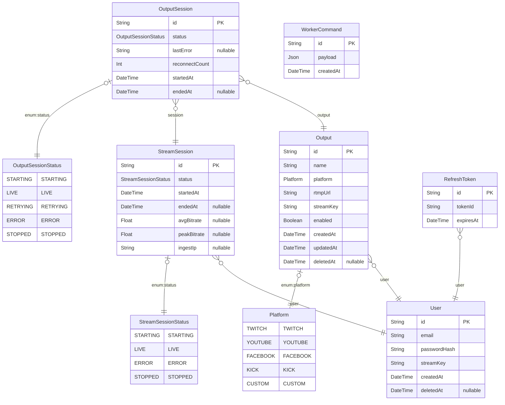

```mermaid
erDiagram

        Platform {
            TWITCH TWITCH
YOUTUBE YOUTUBE
FACEBOOK FACEBOOK
KICK KICK
CUSTOM CUSTOM
        }
    


        StreamSessionStatus {
            STARTING STARTING
LIVE LIVE
ERROR ERROR
STOPPED STOPPED
        }
    


        OutputSessionStatus {
            STARTING STARTING
LIVE LIVE
RETRYING RETRYING
ERROR ERROR
STOPPED STOPPED
        }
    
  "User" {
    String id "PK"
    String email 
    String passwordHash 
    String streamKey 
    DateTime createdAt 
    DateTime deletedAt "nullable"
    }
  

  "Output" {
    String id "PK"
    String name 
    Platform platform 
    String rtmpUrl 
    String streamKey 
    Boolean enabled 
    DateTime createdAt 
    DateTime updatedAt 
    DateTime deletedAt "nullable"
    }
  

  "StreamSession" {
    String id "PK"
    StreamSessionStatus status 
    DateTime startedAt 
    DateTime endedAt "nullable"
    Float avgBitrate "nullable"
    Float peakBitrate "nullable"
    String ingestIp "nullable"
    }
  

  "OutputSession" {
    String id "PK"
    OutputSessionStatus status 
    String lastError "nullable"
    Int reconnectCount 
    DateTime startedAt 
    DateTime endedAt "nullable"
    }
  

  "RefreshToken" {
    String id "PK"
    String tokenId 
    DateTime expiresAt 
    }
  

  "WorkerCommand" {
    String id "PK"
    Json payload 
    DateTime createdAt 
    }
  
    "Output" |o--|| "Platform" : "enum:platform"
    "Output" }o--|| "User" : "user"
    "StreamSession" |o--|| "StreamSessionStatus" : "enum:status"
    "StreamSession" }o--|| "User" : "user"
    "OutputSession" |o--|| "OutputSessionStatus" : "enum:status"
    "OutputSession" }o--|| "StreamSession" : "session"
    "OutputSession" }o--|| "Output" : "output"
    "RefreshToken" }o--|| "User" : "user"
```
